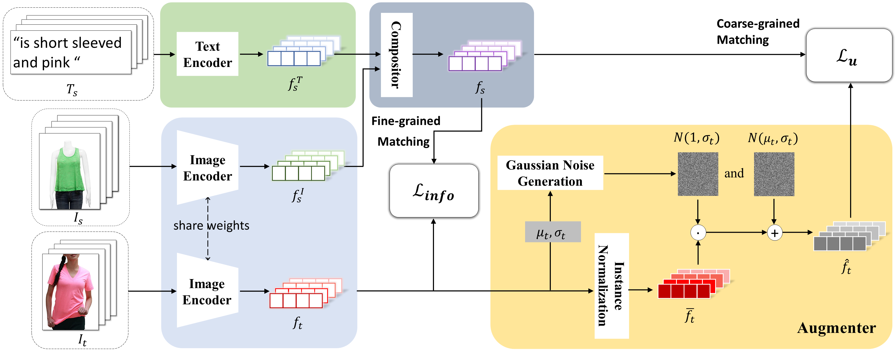

# Multi-grained Uncertainty Regularization

Offical Implementation of [Composed Image Retrieval with Text Feedback via Multi-grained Uncertainty Regularization](https://arxiv.org/abs/2211.07394). 



The baseline code is borrowed from [CoSMo](https://github.com/postBG/CosMo.pytorch). We would like to thank this great work. 

## Install

#### Prerequisites

- Python 3.8
- [Pytorch 1.12.1, torchvision 0.13.1](https://pytorch.org/get-started/previous-versions/#v1121)

#### Required packages

```bash
pip install -r requirements.txt
```

## Dataset

Download any of the three data sets, FashionIQ, Shoes and Fashion200k, to run the code.

We provided the three datasets in [Google Drive](https://drive.google.com/drive/folders/1eLVRNAaZulfrTp1zACxP4wyN3zEpWmbc?usp=share_link) *temporarily* because some image links are not permanent. Follow the requirements of the original author, datasets are only used for academic purposes. 

Copy the dataset folders to the data folder. The data folder is structured as follows:

```
├── data/
│   ├── abc.py
│   ├── collate_fns.py
│   ├── fashion200k.py
│   ├── fashionIQ.py
│   ├── __init__.py
│   ├── shoes.py
│   └── utils.py
│   ├── fashionIQ/
│   │   ├── captions/
│   │   ├── captions_pairs/
│   │   ├── image_data/
│   │   ├── image_splits/
│   │   ├── image_tag_dataset/
│   │   ├── fashion_iq_vocab.pkl
│   │   ├── ...
│   ├── fashion200k/
│   │   ├── labels/
│   │   ├── women/
│   │   ├── fashion200k_vocab.pkl
│   │   ├── ...
│   ├── shoes/
│   │   ├── attributedata/
│   │   ├── shoes_vocab.pkl
│   │   ├── ...
```

## Weights & Biases

We use [Weights and Biases](https://wandb.ai/) to log our experiments. You can register an account or provide an existing one, head it over to `*config.json` and fill out your `wandb_account_name`.You can also change the default at `options/command_line.py`.

## Run

You can run the code by the following command:

```bash
CUDA_VISIBLE_DEVICES=0 python3 main.py --config_path=configs/fashionIQ_config.json --experiment_description=test_fashionIQ --device_idx=$CUDA_VISIBLE_DEVICES
```

## Citation

```bibtex
@misc{https://doi.org/10.48550/arxiv.2211.07394,
  doi = {10.48550/ARXIV.2211.07394},
  url = {https://arxiv.org/abs/2211.07394},
  author = {Chen, Yiyang and Zheng, Zhedong and Ji, Wei and Qu, Leigang and Chua, Tat-Seng},
  keywords = {Computer Vision and Pattern Recognition (cs.CV), FOS: Computer and information sciences, FOS: Computer and information sciences},
  title = {Composed Image Retrieval with Text Feedback via Multi-grained Uncertainty Regularization},
  publisher = {arXiv},
  year = {2022},
  copyright = {arXiv.org perpetual, non-exclusive license}
}
```

